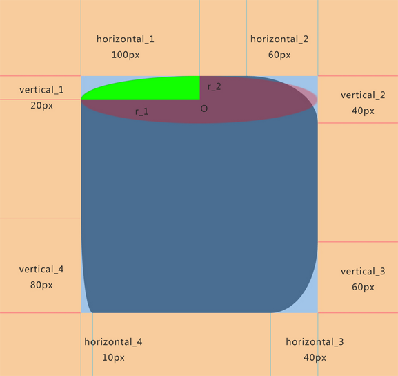
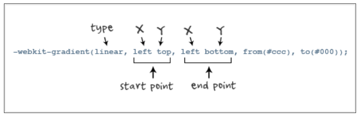
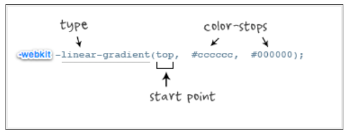

#### css3 新增属性

### 一、css3边框类
#### 1.border-radius
> 可以是长度(length),也可以是百分比(percentage)不允许负值;
> 顺序是:上左、上右、下右、下左
> 1个值：四个角值一样;
> 2个值：第一个是上左、下右;第二个是上右、下左
> 3个值:第一个是上左；第二个是上右、下左；第三个是下右；
> 
>
```
-moz-border-radius: 15px; /* Firefox */
-webkit-border-radius: 15px; /* Safari 和 Chrome */
border-radius: 15px; /* Opera 10.5+, 以及使用了IE-CSS3的IE浏览器 */
```


#### 2.box-shadow
> length:第1个长度值来设置对象的阴影水平偏移值，可以为负值；
> length:第2个长度值来设置对象的阴影垂直偏移值，可以为负值
> length:第3个长度值来设置对象的阴影模糊值，不允许负值;
> length:如果提供了第4个长度值则用来设置对象的阴影外延值，可以为负值;
> color:设置对象的阴影颜色;
> inset:设置对象的阴影类型为内阴影,该值为空时，则对象的阴影类型为外阴影;
属性值    | 属性意义
:-------:|:-----:  
x-offset        | x轴偏移 正值(右) 负值(左)    
y-offfset       | y轴偏移 正值(下) 负值(上)       
blur            | 模糊半径(模糊度) 
blur            | 扩展半径(深度) 正值(阴影扩展) 负值(阴影收缩)
color of shadow | 阴影颜色 
inset           | 内阴影
```
-moz-box-shadow: 10px 10px 20px #000; /* Firefox */
-webkit-box-shadow: 10px 10px 20px #000; /* Safari 和 Chrome */
box-shadow: 10px 10px 20px #000; /* Opera 10.5+, 以及使用了IE-CSS3的IE浏览器 */
```

#### 2.border-color
> 设置和检索对象的边框颜色;顺序是上、右、下、左,如果border-width 等于0或border-style设置为none,本属性将被忽略;
>1个值：四边一样
>2个值：第一个上、下;第二个左、右
>3个值：第一个上、第二个左、右;第三个下
属性值    | 属性意义
:-------:|:-----:  
上        | border-top-color  
右        | border-right-color       
下        | border-bottom-color
左        | border-left-color

### 二、css3背景类
> 常用的基本属性：
> background-color 指定对象的背景颜色
> background-image 指定对象的背景图像
> background-repeat 指定对象的背景图像如何铺排填充
> background-attachment 指定对象的背景图层是随对象内容滚动还是固定的
> backround-position 指定对象的背景图像位置
> 新增加的属性：
> background-origin 指定绘制背景图片的起点
> background-clip  指定背景图片展示的范围
> background-size  指定背景图片的尺寸大小

**1.background-origin**
属性值    | 属性意义
:-------:|:-----:  
padding-box | 从padding区域(含padding) 开始显示背景图像
border-box  | 从border区域(含border)开始显示背景图像     
content-box | 从content区域开始显示背景图像

**2.background-clip**
属性值    | 属性意义
:-------:|:-----:  
padding-box | 从padding区域(不含padding) 开始向外裁剪背景;
border-box  | 从border区域(不含border)开始向外裁剪背景;    
content-box | 从content区域开始向外裁剪背景;
text        | 从前景内容的形状(比如文字)作为裁剪区域向外裁剪，如此即可实现使用背景作为填充色之类的遮罩效果;

**3.background-size**
>检索或设置对象的背景图像的尺寸大小;用长度(length)值指定背景图像大小，用百分比(percentage)指定背景图像大小,都不允许负值;该属性提供2个参数值(特性值cover和contain除外)
>如果提供2个，第一个用于定义背景图像的宽度,第二个用于定义背景图像的高度
>如果只提供一个，该值将用于定义背景图像的宽度,第2个值默认为auto,即高度为auto,此时背景图以提供的宽度作为参照来进行等比缩放;

**4.gradient**
>允许使用简单的语法实现颜色渐变，渐变在一个拥有尺寸的盒子中被生成，被称之为渐变盒，但是渐变本身并没有内在的尺寸，也就是说如果一个没有尺寸的容器上定义渐变，将无法被呈现;
>>第1个参数:表示渐变类型(type),可以是linear(线性渐变)或者radial(径向渐变);
>第2个参数和第3个参数,都是一对值,分别表示渐变起点和终点。这对值可以用坐标形式表示，也可以用关键值表示，比如left top(左上角)和left bottom(左下角)
>第4个和第5个参数，分别是两个color-stop函数。color-stop函数接受2个参数，第1个表示渐变的位置，0为起点，0.5为中点，1为结束点;第2个表示该点的颜色。
>>>to left：设置渐变为从右到左。相当于: 270deg
to right：设置渐变从左到右。相当于: 90deg
to top：设置渐变从下到上。相当于: 0deg
to bottom：设置渐变从上到下。相当于: 180deg



```
老式写法示例:
background:-webkit-gradient(linear,center top,center bottom,from(#ccc),to(#000));

新式写法示例:
-webkit-linear-gradient(top,#ccc,#000);
```

**4.filter滤镜模糊**
|属性|属性值|取值|
|:---:|:---:| :---:
|grayscale| 灰度|值为0-1之间的小数
|sepia| 灰褐色|值为0-1之间的小数
|saturate | 饱和度|值为num
|hue-rotate| 色相旋转|值为angle
|invert | 反色|值为0-1之间的小数
|opacity| 灰透明度|值为0-1之间的小数
|brightness| 亮度|值为0-1之间的小数
|contrast | 对比度|值为num
|blur | 模糊|值为length
|drop-shadow| 阴影||

### 三、css3文本类
**1.text-shadow**
```
设置或检索对象中文本的文字是否有阴影及模糊效果：
<length>第1个长度值用来设置对象的阴影水平偏移值。可以为负值
<length>第2个长度值用来设置对象的阴影垂直偏移值。可以为负值
<length>如果提供了第3个长度值则用来设置对象的阴影模糊值。不允许负值
<color>：设置对象的阴影的颜色。
```

**2.text-overflow**
```
clip:当内容溢出块容器时，将溢出部分裁切掉;
ellipsis:当内容溢出块容器时，将溢出部分替换为省略号"..."
text-overflow生效必备的3个属性:overflow、width、white-space
```


**3.word-wrap**
```
设置或检索当内容超过指定容器的边界时是否断行
normal:允许内容顶开或溢出指定的容器边界;
break-word:内容将在边界内换行,如果需要,单词内部允许断行;
```
### 四、css3用户界面类
**1.box-sizing**
```
设置或检索对象的盒模型组成模式
content-box:padding和border不被包含在定义的width和height之内,对象的实际宽度等于设置的width值和border、padding之和，即（Element width=width+border+padding）
border-box:padding和border被包含在定义的width和height之内。对象的实际宽度就等于设置的width值，即使定义有border和padding也不会改变对象的实际宽度，即(Element width=width)
此属性表现为怪异模式下的盒模型
```


    　　　　 
    　　　　　　     
     


   
