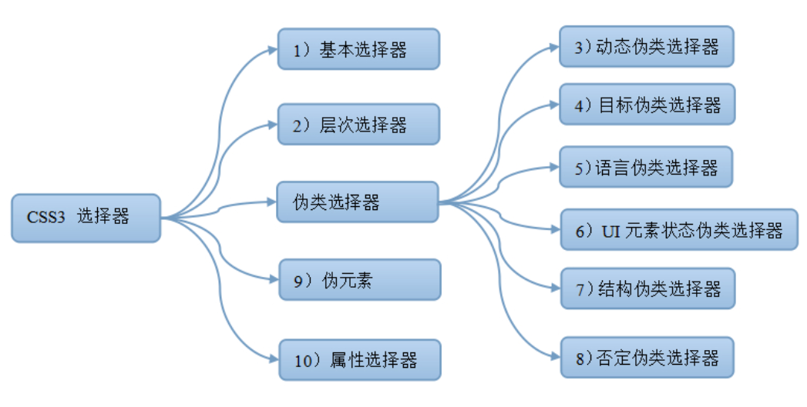

####   css3选择器

##### 一、基本选择器
选择器|类型|功能描述
:---|:-----:|:----
*|通配符选择器|选择文档中所有的HTML元素|
Element|元素选择器|选择指定类型的HTML元素| 
id(#)|ID选择器|选择指定ID属性值为"id"的任意类型元素
.class|类选择器|选择指定class属性值为'class'的任意类型的任意多个元素
selector1,selectorN|群组选择器|将每一个选择器匹配的元素集合并|

##### 二、层次选择器
选择器|类型|功能描述
:---|:-----:|:----
E F|后代选择器|选择匹配的F元素,且匹配的F元素被包含在匹配的E元素内|
E>F|子选择器|选择匹配的F元素，且匹配的F元素所匹配的E元素的子元素|
E+F|相邻兄弟选择器|选择匹配的F元素，且匹配的F元素紧位于匹配的E元素的后面|
E~F|通用选择器|选择匹配的F元素，且位于匹配的E元素后的所有匹配的F元素|

##### 三、伪类选择器
###### 1)动态伪类选择器
选择器|类型|功能描述
:---|:-----:|:----
E:link|链接伪类选择器|选择匹配的E元素，而且匹配元素被定义了超链接并未被访问过。常用于链接描点上|
E:visited|链接伪类选择器|选择匹配的E元素，而且匹配元素被定义了超链接并已被访问过。常用于链接描点上|
E:active|用户行为选择器|选择匹配的E元素，且匹配元素被激活。常用于链接描点和按钮上|
E:hover|用户行为选择器|选择匹配的E元素，且用户鼠标停留在元素E上。IE6及以下浏览器仅支持a:hover|
E:focus|用户行为选择器|选择匹配的E元素，而且匹配元素获取焦点|

###### 2)目标伪类选择器
选择器|功能描述
:---|:----:
E:target|选择匹配E的所有元素，且匹配元素被相关URL指向|

###### 3)UI元素状态伪类选择器
选择器|类型|功能描述
:---|:----|:---
E:checked|选中状态伪类选择器|匹配选中的复选按钮或者单选按钮表单元素|
E:enabled|启用状态伪类选择器|匹配所有启用的表单元素|
E:disabled|不可用状态伪类选择器|匹配所有禁用的表单元素|

###### 4)结构伪类选择器
选择器|功能描述
:---|:----
E:fisrt-child|作为父元素的第一个子元素的元素E。与E:nth-child(1)等同
E:last-child|作为父元素的最后一个子元素的元素E。与E:nth-last-child(1)等同
E:root|选择匹配元素E所在文档的根元素。在HTML文档中，根元素始终是html，此时该选择器与html类型选择器匹配的内容相同
E F:nth-child(n)|[E下的第n个子元素F] 注:n从1开始,可以是数字,也可以是even、odd,还可以是公式:2n/2n+1/n+5(从第五个开始)/-n+5(第一个到第五个)...
E F:nth-last-child(n)|选择倒数第n个
E:nth-of-type(n)|选择父元素内具有指定类型的第n个E元素
E:nth-last-of-type(n)|选择父元素内具有指定类型的倒数第n个E元素
E:first-of-type|选择父元素内具有指定类型的第一个E元素，与E:nth-of-type(1)等同
E:last-of-tye|选择父元素内具有指定类型的最后一个E元素，与E:nth-last-of-type(1)等同
E:only-child|只有一个子元素
E:only-of-type|选择父元素只包含一个同类型子元素，且该子元素匹配E元素
E:empty|一个子元素都没有

###### 5)否定伪类选择器
选择器|功能描述
:---|:----
E:not(F)|匹配所有除元素F外的E元素

##### 四、属性选择器
选择器|功能描述
:---|:----
[attribute]|用于选取带有指定属性的元素。
[attribute=value]|用于选取带有指定属性和值的元素。
[attribute~=value]|用于选取属性值中包含指定词汇的元素。
[attribute|=value]|用于选取带有以指定值开头的属性值的元素，该值必须是整个单词。
[attribute^=value]|匹配属性值以指定值开头的每个元素。
[attribute$=value]|匹配属性值以指定值结尾的每个元素。
[attribute*=value]|匹配属性值中包含指定值的每个元素。

