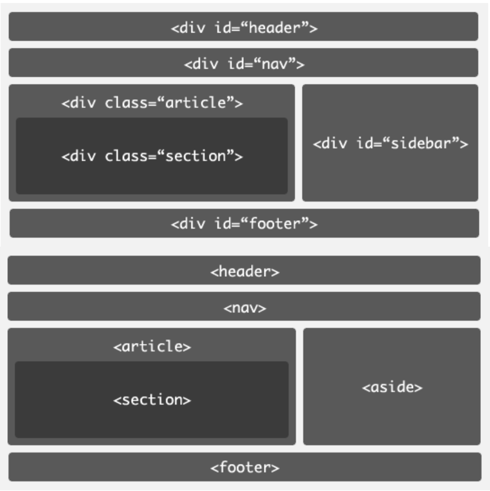
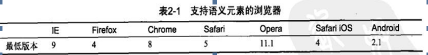

#### html5新增标签和兼容处理
> 在之前的HTML页面中，大家基本上都是用了Div+CSS的布局方式。而搜索引擎去抓取页面的内容的时候，它只能猜测你的某个Div内的内容是文章内容容器，或者是导航模块的容器，或者是作者介绍的容器等等。也就是说整个HTML文档结构定义不清晰，HTML5中为了解决这个问题，专门添加了：页眉、页脚、导航、文章内容等跟结构相关的结构元素标签。




#### 1.header
```
标签定义文档的页眉,通常是一些引导和导航信息，它不局限写在网页头部，也可以写在网页内容里面。通常<header>标签至少包含（但不局限于）一个标题标记(<h1>~<h6>),还可以包括<hgroup>标签，还可以包括表格内容、标识、搜索表单、<nav>导航等；
<header>
	<hgroup>
		<h1>网站标题</h1>
		<h2>网站副标题</h2>
	</hgroup>
</header>
```

#### 2.nav
```
nav标签代表页面的一个部分,是一个可以作为页面导航的链接组，其中的导航元素链接到其他页面或者当前页面的其他部分，使html代码在语义化方面更加精确，同时对于屏幕阅读器等设备的支持也更好；
<nav>
	<ul>
		<li>珠峰培训首页</li>
	    <li>node培训课程</li>
	    <li>html5培训课程</li>
	    <li>珠峰论坛</li>
	</ul>
</nav>
```

#### 3.section
```
    section标签，定义文档中的节。比如章节、页眉、页脚或文档中的其他部分。一般用于成节的内容，会在文档流中开始一个新的节。它用来表现普通的文档内容或应用区块，通常由内容及其标题组成。但section元素标签并非一个普通的容器元素，它表示一段专题性的内容，一般会带有标题。
    
   当我们描述一件具体的事物的时候，通常鼓励使用artice来代替section;当我们使用section时，仍然可以使用h1来作为标题，而不用担心它所处的位置，以及其它地方是否用到;当一个容器需要被直接定义样式或通过脚本定义行为时，推荐使用div元素而非section;
<section>
    <h1>section是什么？</h1>
    <p>是一个独立的章节</p>
    <article>
       <h2>关于section</h1>
        <p>section的介绍</p>
    </article>
 </section>
```

#### 4.article
```
article是一个特殊的section标签，它比section具有更明确的语义，它代表一个独立的，完整的相关内容块，可独立于页面其他内容使用。例如一篇完整的论坛帖子，一篇博客文章，一个用户评论等等。一般来说，article会有标题部分(通常包含在header内),有时也会包含footer。article可以嵌套，内层的article对外层的article标签有隶属关系。例如，一篇博客文章，可以用article显示，然后一些评论可以以article的形式嵌入其中;
<article>
    <header>
        <hgroup>
            <h1>这是一篇介绍HTML 5结构标签的文章</h1>
            <h2>HTML 5的革新</h2>
       </hgroup>
       <time datetime="2016-11-18">2016.11.18</time>
  </header>
  <p>文章内容详情</p>
 </article>
```

#### 5.aside
```
aside标签用来装载非正文的内容，被视为页面里面一个单独的部分。它包含的内容与页面的主要内容是分开的，可以被删除，而不会影响网页的内容、章节或是页面所要传达的信息。例如广告，成组的链接，侧边栏等等。
 <aside>
     <h1>简介</h1>
     <p>我是简介内容，嘿嘿</p>
 </aside>
```

#### 6.footer
```
footer标签定义section或document的页脚，包含了与页面、文章或是内容有关的信息，比如说文章的作者或者日期。作为页面的页脚时，一般包含了版权、相关文件和链接。它和header标签使用基本一样，可以在一个页面中多次使用，如果在一个区段的后面加入footer,那么它就相当于该区段的页脚了。
<footer>
   <span>copyRight@珠峰培训</span>
</footer>
```

#### 7.hgroup
```
hgroup标签是对网页或区段section的标题元素(h1~h6)进行组合。例如,在一区段中你有连续的h系列的标签元素，则可以用hgroup将他们括起来。
<hgroup>
    <h1>主标题</h1>
    <h2>副标题</h2>
</hgroup>
```

#### 8.figure
```
用作文档中插图的图像，带有一个标题
<figure>
      <figcaption>标题</figcaption>
      
 </figure>
```

#### 9.figcaption
```
标签定义figure元素的标题(caption)。"figcaption"元素应该被置于"figure"元素的第一个或最后一个子元素的位置。
<figure>
      
      <figcaption>标题</figcaption>
 </figure>
```

#### 10.datalist
```
datalist标签定义选型列表。请与input元素配合使用该元素，来定义input可能的值。datalist及其选项不会被显示出来，它仅仅是合法的输入值列表。请使用input元素的list属性来 绑定datalist。所有主流浏览器都支持此标签，除了Internet Explorer和Safari。
<input id="myCar" list="cars" />
<datalist id="cars">
  <option value="BMW">
  <option value="Ford">
  <option value="Volvo">
</datalist>
```

#### 11.audio
```
定义声音，比如音乐或其它音频流：其相关的属性
autoplay 如果出现该属性，则音频在就绪后马上播放;
controls 如果出现该属性，则向用户显示控件，比如播放按钮;
loop 如果出现该属性，则每当音频结束时重新开始播放；
muted 规定视频输出应该被静音；
preload 如果出现该属性，则音频在页面加载时进行加载，并预备播放,如果出现"autoplay"则忽略该属性；
src 要播放的音频的url

<audio id="audio" preload="auto" autoplay="autoplay" loop="loop" src="http://song4u.u.qiniudn.com/blog/audio/gt.mp3">
</audio>
```

#### 12.video
```
定义视频，比如电影片段或其它视频流：其相关的属性
autoplay 如果出现该属性，则视频在就绪后马上播放;
controls 如果出现该属性，则向用户显示控件，比如播放按钮;
height 设置视频播放器的高度;
loop 如果出现该属性，则当媒介文件完成播放后再次开始播放；
preload 如果出现该属性，则视频在页面加载时进行加载，并预备播放,如果出现"autoplay"则忽略该属性；
src 要播放的音频的url；
width 设置视频播放器的宽度；

<video width="320" height="240" controls>
    <source src="movie.mp4" type="video/mp4">
    <source src="movie.ogg" type="video/ogg">
    您的浏览器不支持 video 标签。
</video>
```

#### 13.canvas
```
canvas标签定义图形，比如图表和其他图像，canvas标签只是图形容器，您必须使用脚本来绘制图形;

<canvas id="myCanvas"></canvas>
<script type="text/javascript">
var canvas=document.getElementById('myCanvas');
var ctx=canvas.getContext('2d');
ctx.fillStyle='#FF0000';
ctx.fillRect(0,0,80,100);
</script>
```

>总结：
>1、新增加一些构建页面语义化的结构标签 ，对原有 标签进行了修改
>header、nav、section、footer、article、aside、figure、figcaption、hgroup...
>>
 (在IE6~8浏览器中不识别这些新增加的标签,导致布局结构混乱)在页面中引入```
<!--[if lt IE 9]>
 <script type="text/javascript" src="HTML5.min.js"></script>
  <![endif]-->
  ```
  >
 2、给我们的INPUT表单元素增加了很多新的类型(不兼容)
>> 原有:text、password、radio、checkbox、button、submit、reset、file...
>> 新增:search、url、email、tel、number、date、time、color、range...
>作用: 
1)根据TYPE的类型不一样,会调取出最符合用户输入的物理键盘;
2)传统的表单验证:当某个行为触发的时候,我们获取用户输入的内容和自己编写的正则进行验证从而判断用户输入的是否符合规则;
3) HTML5中提供了CSS3/JS的新验证方式,不需要自己写正则,浏览器自己就已经实现了验证,我们只需要控制成功/不成功的样式或者其他操作即可
>
3、新增加了音视频处理AUDIO、VIDEO
4、新增加CANVAS绘图
>>http://www.hcharts.cn/(Highcharts)
     http://echarts.baidu.com/(echarts)
     D3.js
  >
5、新增加一些新的有助于开发的API:本地存储、地理位置、websocket、webworks...离线缓存


