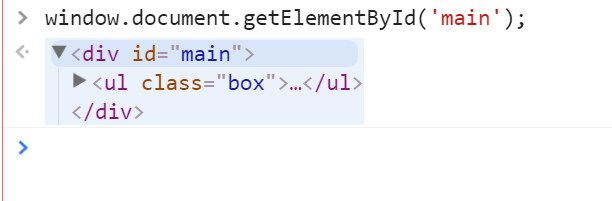

#1周周末2
###while循环
```
	while (//循环的判断条件){
	//条件成立执行的代码}
	var num = 1;
    while (num < 100) {
        console.log(num+=4);
    }
```
###获取DOM中html标签的方式
>
```
	document.getElementById('main')
	// 获取的到的是，id='main'的这个DOM节点，包含他的子节点。

	//document.getElementsByTagName();
	//document.getElementsByClassName();
	上边这两个方法，获取到的是节点集合，我可以理解为是一个数组，所以他不能使用DOM的getElement这个方法了。

    //document.querySelectorAll();
    括号里边填写('.类名') ('html标签名') ('#id名')	
    这个方法获取到的DOM，也是一个节点集合，我们也可以理解为，一个数组，所以他也不能使用DOM的getElement这个方法了。

	
	//document.getElementsByName();
	<li><input type="text" name="zs" id="zs" value="刘能杀手"></li>
	document.getElementsByName('zs');
	括号里边填写('name的值')，获取到的对象是节点集合，也可以理解为一个数组，所以他也不能使用DOM的getElement这个方法了。
```
###绑定事件
```
// 1、先看给谁绑定事件，就先获取谁的dom节点
// 比如给li绑定事件
li.onlick
li.onmosueover 
li.onmouseout
// 2、格式   DOM. + onclick(事件类型) 绑定事件
li.onclick = function () {
	//给事件绑定的方法
}
// 3、当我们触发事件的时候，方法会自动执行
```
### i++ 和 ++i
// i  i++ 相当于i要吃饭补充一下
// 等着i干活  先干活再吃饭
//i ++i
// 等着i干活  先吃饱了再干活
```
var i = 0;
var num = ++i;
console.log(num)
```
###引用数据类型解析
```
					// 相当于 var obj 局部变量
  function setName(obj){
   obj.name = "奥巴马"; // var obj = president
					      // obj.name = '奥巴马'
   obj = {name:"克林顿"};// obj = {name: '克林顿' }
  }

    var president = { name: "布石" };

    setName(president);

    console.dir(president);
```